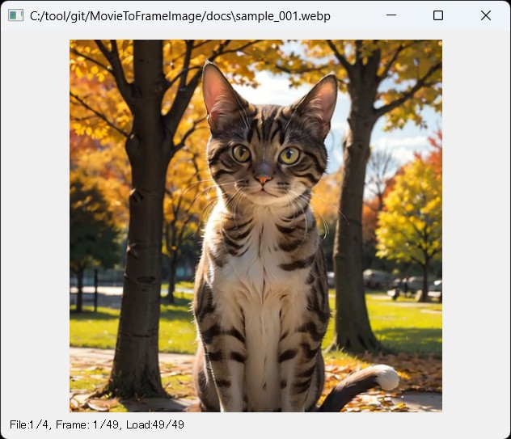

## MovieToFrameImageについて 0.2.1
短い動画ファイル(webp,mp4)から指定フレームを画像として出力します  
生成AIなどで作成した動画の一部分から別の動画を作る際のスタート／エンドフレームを抽出するのを目的※としています  
> [!CAUTION]
> - 全フレームをメモリに展開するので、短い動画でのみ利用してください！
> - 例えば1024x720、30fps、4分程度（7300フレーム）の動画で【14GB】くらいメモリを使用します！！
> - 現状では5000フレームを上限（DEF_MAX_FRAME）とし表示を中断します

※主に以下のようなケースでの利用を想定しています  
・途中までは良かったのでそこから続きを作りたい  
・最終フレームは少しブレているのでもう少し手前のフレームから続きを作りたい  
・前半がイマイチなので途中のフレームをエンドフレームとした動画を生成し直したい  
（簡易な編集や結合にはWebpAnim2Mp4をご利用ください）

## 特徴
- 動画をマウスホイールでシークして特定フレームを画像化
- 動画ファイルやフォルダをドラッグ＆ドロップ可能
- 生成した動画を早送り再生し、後処理対象を見つけて特定フォルダへコピー(New! 0.2.0)
- 生成した動画をマウスホイールでコロコロして堪能？

## インストール方法（簡易）
[簡易インストール版zipのダウンロード]  
    https://github.com/nekotodance/MovieToFrameImage/releases/download/latest/MovieToFrameImage.zip  

- Pythonのインストール（SD標準の3.10.6推奨）
- zipファイルを解凍
- 解凍したフォルダ内の「mf-install.ps1」を右クリックして「PowerShellで実行」を選択
> [!WARNING]
> シェルスクリプトはデフォルトでは動作しない設定となっています  
> その場合はターミナルを管理者として実行し、以下のコマンドを実行してください（比較的安全な方式）  
> Set-ExecutionPolicy Unrestricted -Scope CurrentUser -Force

- イントールの最後にデスクトップにリンクをコピーするかどうかを聞いてきます  
「"Do you want to copy the shortcut to your desktop? (y or enter/n)」  
必要があれば「y」入力後、もしくはそのまま「enter」キー  
必要なければ「n」入力後「enter」キー  
- MovieToFrameImageリンクが作成されます

## インストール方法（手動）
- Pythonのインストール（SD標準の3.10.6推奨）
- gitのインストール
- gitでリポジトリを取得  
`git clone https://github.com/nekotodance/MovieToFrameImage`
- 必要なライブラリ  
`pip install -r requirements.txt`
- 実行方法  
`Python MovieToFrameImage.py`

## 設定ファイルについて
MovieToFrameImage.jsonに以下の情報を保持しています  

- コピー先のディレクトリ設定
  - image-fcopy-dir   : W,上キーによるファイルのコピー先フォルダ名  
> [!CAUTION]
> image-fcopy-dirは【自分の環境に合わせて必ず】書き換えてください！  
> またパスの区切り文字は、ウインドウズの「W:\\_temp\\ai」ではなく「W:/_temp/ai」として記載してください  

## 利用方法
アプリ上に動画ファイル(webp,mp4)もしくは動画が入ったフォルダをドラッグ＆ドロップしてください  

#### 操作方法
- 動画の再生[^1]／停止
    - マウス左クリック、スペースキー
    - 再生x1、x2、x4、x8、停止のトグル動作
    - 初期表示は再生状態、ホイールでのフレーム移動やフレーム画像化の後はPause状態
- 前後フレームへ移動
    - マウスホイール、左右キー、ADキー
    - 最終フレームから先頭フレーム、先頭フレームから最終フレームへのループ時に効果音でお知らせ
- 表示フレームの画像化[^2]
    - マウス右クリック、上キー、Wキー
- 前後ファイルへ移動
    - マウスの戻る進むボタン、,(コンマ).(ピリオド)キー、QEキー
- フィット表示
    - マウス中クリック、Fキー、0123キー
    - 0キーで1/2表示、1キーで2倍表示、3キーで3倍表示、その他のキーは等倍表示
- 表示中のファイルをコピー
    - Rキー、Returnキー
    - 設定ファイルで指定したコピー先のディレクトリに表示中のファイルをコピー
- 終了
    - ESC、/(スラッシュ)キー、\(バックスラッシュ)キー

#### フレーム画像の命名規則
- 元のファイル名に_frm<4桁のフレーム番号>を付けたpngファイルとして保存します  
    例）test.webp -> test_frm0001.png  

#### 情報表示表示
- ウインドウタイトル  
    ファイル名を表示  
- ステータス部分  
    例）File:1/4, Frame: 6/49, Loaded, pause 2x  
    File部：表示中のファイル番号/同じ階層の動画ファイル総数  
    Frame部：表示中のフレーム番号/フレーム総数  
    Load部：Load済みフレーム数/フレーム総数、もしくはLoaded（ロード完了）  
    Play部：stop, play, pauseの状態の後ろに再生速度（1x - 8x）  
    もしくはファイルのロード状態やエラー状態などを表示します。  

## 変更履歴
- 0.2.1 微修正
- 0.2.0 大幅変更、早送り機能追加
- 0.1.2 UIを改善（ロード処理をバックグラウンドに変更）
- 0.1.1 UIを改善
- 0.1.0 初版（プレビュー版。エラーチェックやUIの改善はこれから）

[^1]:再生速度について  
本来WebPもmp4も可変フレームレートに対応してますが、固定フレームレートとして簡易に再生します  
そもそもタイマーで次のフレームに移動してますので、本来の速度よりだいぶん遅いはずです  

[^2]:表示フレームの画像化について  
すでに画像化したファイルが存在する場合に消します（トグル動作）  
